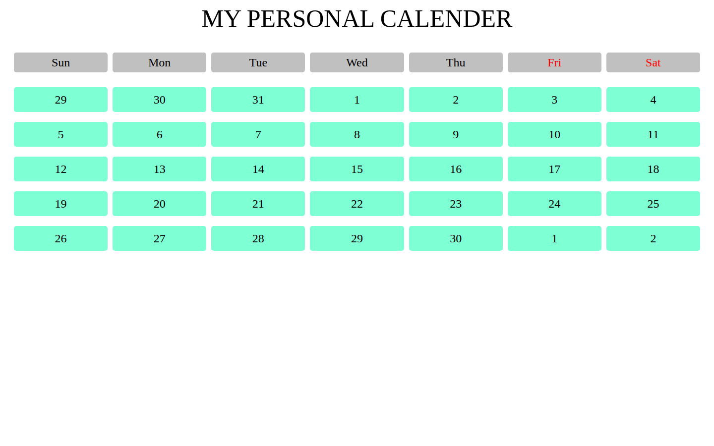

# My Personal Calendar

A month-view calendar layout built with CSS Grid in a single HTML file.

**Live page:** <https://shayan-abrar.github.io/Calender/calender>

<p align="center">
  
</p>

A calendar is a good way to practice grid layout: seven equal columns, a header row and evenly spaced rows of cells. This page does exactly that with a few lines of CSS and no JavaScript, so the whole layout is easy to read in one sitting.

## Quick Start

```bash
git clone https://github.com/SHAYAN-ABRAR/Calender.git
cd Calender
python3 -m http.server 8000
```

Open <http://localhost:8000/calender.html>. On Windows, use `python` instead of `python3`. You can also open `calender.html` directly in a browser, because the page has no external dependencies.

## Features

- **Seven-column grid:** weekday headers from Sunday to Saturday, with equal-width columns.
- **Weekend colors:** the Friday and Saturday headers are shown in red.
- **Full month view:** the last days of the previous month and the first days of the next month fill the first and last rows.
- **Even spacing:** `row-gap` and `column-gap` separate the cells, and flexbox centers each number.

## How the Layout Works

The grid in `calender.html` defines seven equal columns and six fixed-height rows (one for the weekday headers and five for dates):

```css
.calender {
    display: grid;
    grid-template-columns: repeat(7, 1fr);
    grid-template-rows: repeat(6, 50px);
    row-gap: 20px;
    column-gap: 10px;
    margin: 0 20px;
}
```

To change the spacing, adjust `row-gap` and `column-gap`. To change the cell color, edit `background-color` in `.date`.

## Limitations

This is a static layout. The dates are written into the HTML, and there's no month name, date calculation or navigation between months.

## Tech Stack

- HTML5
- CSS3 (Grid and Flexbox) in an embedded `<style>` block

## Contributing

Suggestions and bug reports are welcome. Please [open an issue](https://github.com/SHAYAN-ABRAR/Calender/issues). The code isn't licensed for reuse, so please ask before copying or redistributing it.

## License

Copyright © 2024 Shayan Abrar. All rights reserved. See [LICENSE](LICENSE). This isn't an open-source license.

---

Built by **Shayan Abrar** · [GitHub](https://github.com/SHAYAN-ABRAR) · [LinkedIn](https://www.linkedin.com/in/shayan-abrar/)
